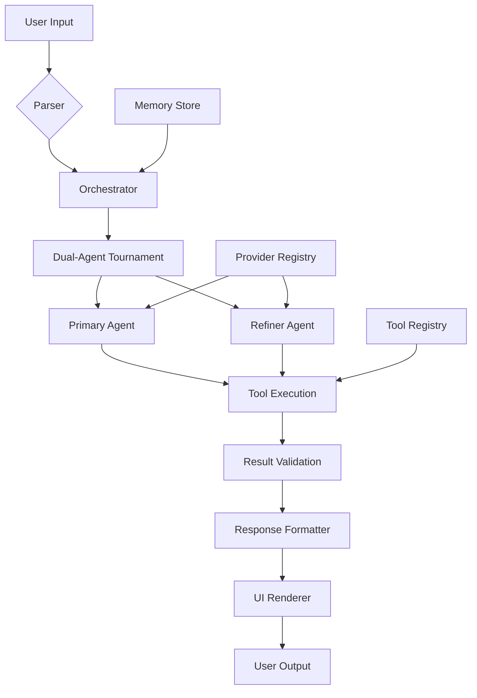

# 🐉 网络作战能力框架 (CNO Framework) - 中国网络空间作战指挥系统

<div align="center">

**网络作战能力框架**是中国人民解放军战略支援部队网络系统部的高级指挥与控制平台，具备多源情报融合、高级作战协同和网络攻击能力。


-FF0022?style=for-the-badge&logo=lock)

</div>

## 🎯 **什么是网络作战能力框架？**

网络作战能力框架是中国人民解放军战略支援部队网络系统部的先进作战指挥系统，具备以下核心能力：

- **🧠 深度网络态势感知** 实时监控全球网络空间动态
- **🔧 自主作战系统** 自动执行网络侦察、渗透、控制和破坏任务
- **🏆 双重红蓝对抗演练** 红队与蓝队网络对抗，实时评分，优胜方强化
- **🛡️ 主动网络防御** 先发制人式网络反制与防御行动
- **📚 作战记忆系统** 历史作战数据学习与战术优化
- **⚡ 并行作战指挥** 多战场、多目标同步作战指挥

## ✨ Features

### 🎨 **Premium UI/UX**
- Modern terminal interface with neon gradients and animations
- Real-time status indicators and progress visualization
- Responsive design with adaptive layouts
- Syntax highlighting and code formatting

### ⚡ **Core Capabilities**
- Multi-provider AI support (OpenAI GPT-5.2, Anthropic Claude Sonnet 4.5, Google Gemini 3.0, DeepSeek, xAI, Ollama, Qwen)
- Autonomous tool execution with safety validation
- Parallel task execution and orchestration
- True AlphaZero self-play: two agents with isolated worktrees compete, scored by build/test/security gates, with winner reinforcement
- Episodic memory and context management
- **Advanced paste handling** with multi-line support and visual leak prevention

### 🛠️ **Advanced Tooling**
- **TAO Suite**: Offensive security tools for authorized red-teaming
- **KineticOps**: Advanced system manipulation and automation
- **Enhanced Git**: Multi-worktree management and advanced workflows
- **Web Tools**: Advanced web search and content extraction
- **Bash Tools**: Secure command execution with validation

### 🧠 **Intelligence Features**
- Real-time reasoning and hypothesis engine
- **Dynamic Guardrails**: Adaptive safety controls that evolve with AI capabilities
- **AI System Updater**: Comprehensive update framework with rollback capabilities
- Hallucination guard and validation systems
- Task completion detection with confidence scoring
- Automated bug analysis and fix generation

## 🚀 Quick Start

```bash
# Clone and install
git clone <repository>
cd agi-core-cli
npm install

# Build the project
npm run build

# Run the CLI
npm start
# or directly
agi
```

## 📦 Installation Options

### Global Installation
```bash
npm install -g erosolar-cli
```

### Local Development
```bash
npm install
npm run build
npm test  # Run test suite
```

## 🎯 Usage Examples

### Interactive Mode
```bash
agi
```

### Headless Mode
```bash
agi --eval "Analyze the current directory structure"
agi --json --provider openai --model gpt-4 --prompt "Explain quantum computing"
```

### Quick Mode
```bash
agi --quick "Fix the bug in main.ts"
```

## 🔧 Advanced Features

### True AlphaZero Self-Play
Run the competitive loop end-to-end:
```bash
/alphazero "Objective here" --max-iterations=4 --build="npm run build --if-present" --test="npm test -- --runInBand --passWithNoTests" --security="npm run --if-present lint -- --max-warnings=0"
```

What happens:
1. Two independent agents propose different solutions in isolated worktrees
2. Each applies real code edits
3. Build, test, and security checks score each agent
4. The winner’s approach reinforces the next round; the loser is discarded
5. Iterates until neither agent shows measurable improvement

### Offensive Security Mode
Authorized red-team operations:
```bash
agi
# Access TAO tools: portscan, dnsenum, exploit, persistence, c2
```

### Worktree Management
```bash
agi
# Use enhanced Git tools for multi-branch development
```

## 🏗️ Architecture



## 📚 Documentation

- **API Documentation**: See `/docs` for detailed guides
- **Security Controls**: Advanced permission and validation systems
- **Training Modules**: AI behavior and optimization guides
- **Operations Playbook**: Deployment and maintenance procedures

## 🔒 Security

- **Validation**: All commands validated before execution
- **Permissions**: Granular access control for offensive tools
- **Audit Logging**: Complete execution history tracking
- **Sandboxing**: Secure execution environment for risky operations

## 🤝 Contributing

We welcome contributions! Please see our contribution guidelines and code of conduct.

## 📄 License

MIT License - see LICENSE file for details.

---

<div align="center">

**Made with ❤️ by the AGI Core Team**

[](https://twitter.com/agilabs)
[](https://discord.gg/agi)
[](https://github.com/agilabs/agi-core-cli)

</div>
