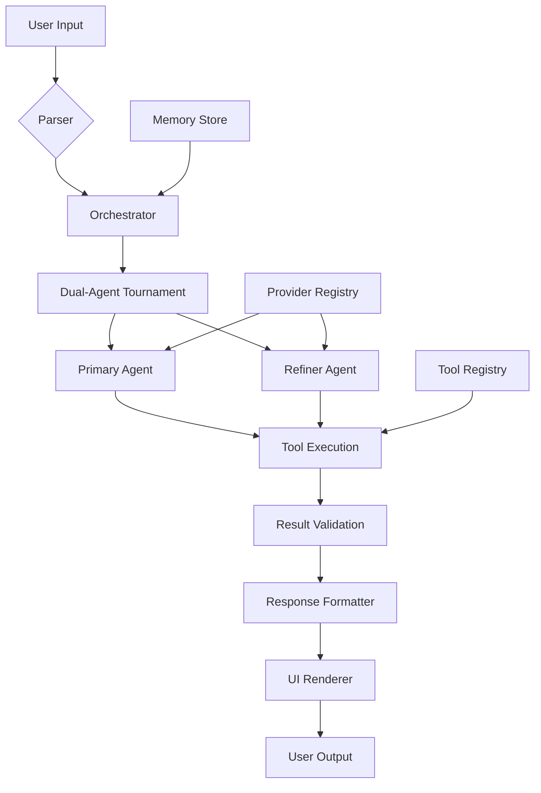

# 🚀 AGI Core - Elite AI Agent Framework

<div align="center">

**AGI Core** is a premium AI agent framework with multi-provider support, advanced orchestration, and offensive security tooling.


</div>

## 🎯 **What is AGI Core?**

AGI Core is an advanced AI coding assistant that goes beyond simple chat. It's a **production-ready framework** that can:

- **🧠 Understand your codebase** and make intelligent edits
- **🔧 Execute tools autonomously** (edit files, run commands, search web)
- **🏆 Run competitive AI tournaments** (Dual-RL mode for better solutions)
- **🛡️ Perform security scanning** (authorized red-teaming with TAO Suite)
- **📚 Learn from past work** (episodic memory system)
- **⚡ Parallelize operations** for faster task completion

## ✨ Features

### 🎨 **Premium UI/UX**
- Modern terminal interface with neon gradients and animations
- Real-time status indicators and progress visualization
- Responsive design with adaptive layouts
- Syntax highlighting and code formatting

### ⚡ **Core Capabilities**
- Multi-provider AI support (OpenAI, Anthropic, Google, DeepSeek, xAI)
- Autonomous tool execution with safety validation
- Parallel task execution and orchestration
- Dual-agent reinforcement learning tournament
- Episodic memory and context management

### 🛠️ **Advanced Tooling**
- **TAO Suite**: Offensive security tools for authorized red-teaming
- **KineticOps**: Advanced system manipulation and automation
- **Enhanced Git**: Multi-worktree management and advanced workflows
- **Web Tools**: Advanced web search and content extraction
- **Bash Tools**: Secure command execution with validation

### 🧠 **Intelligence Features**
- Real-time reasoning and hypothesis engine
- Hallucination guard and validation systems
- Task completion detection with confidence scoring
- Automated bug analysis and fix generation

## 🚀 Quick Start

```bash
# Clone and install
git clone <repository>
cd agi-core-cli
npm install

# Build the project
npm run build

# Run the CLI
npm start
# or directly
agi
```

## 📦 Installation Options

### Global Installation
```bash
npm install -g erosolar-cli
```

### Local Development
```bash
npm install
npm run build
npm test  # Run test suite
```

## 🎯 Usage Examples

### Interactive Mode
```bash
agi
```

### Headless Mode
```bash
agi --eval "Analyze the current directory structure"
agi --json --provider openai --model gpt-4 --prompt "Explain quantum computing"
```

### Quick Mode
```bash
agi --quick "Fix the bug in main.ts"
```

## 🔧 Advanced Features

### Dual-Agent RL Tournament
Enable competitive AI analysis with:
```bash
# Toggle during session with Ctrl+Shift+D
agi
# Then use /features alphazerodual on
```

### Offensive Security Mode
Authorized red-team operations:
```bash
agi
# Access TAO tools: portscan, dnsenum, exploit, persistence, c2
```

### Worktree Management
```bash
agi
# Use enhanced Git tools for multi-branch development
```

## 🏗️ Architecture



## 📚 Documentation

- **API Documentation**: See `/docs` for detailed guides
- **Security Controls**: Advanced permission and validation systems
- **Training Modules**: AI behavior and optimization guides
- **Operations Playbook**: Deployment and maintenance procedures

## 🔒 Security

- **Validation**: All commands validated before execution
- **Permissions**: Granular access control for offensive tools
- **Audit Logging**: Complete execution history tracking
- **Sandboxing**: Secure execution environment for risky operations

## 🤝 Contributing

We welcome contributions! Please see our contribution guidelines and code of conduct.

## 📄 License

MIT License - see LICENSE file for details.

---

<div align="center">

**Made with ❤️ by the AGI Core Team**

[](https://twitter.com/agilabs)
[](https://discord.gg/agi)
[](https://github.com/agilabs/agi-core-cli)

</div>
